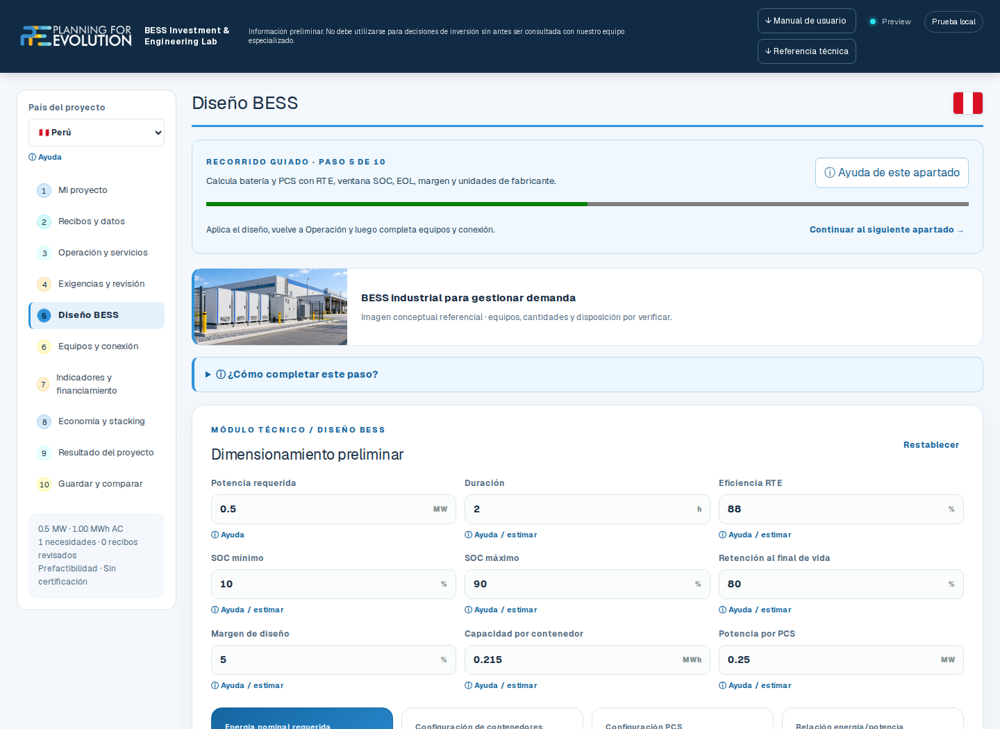
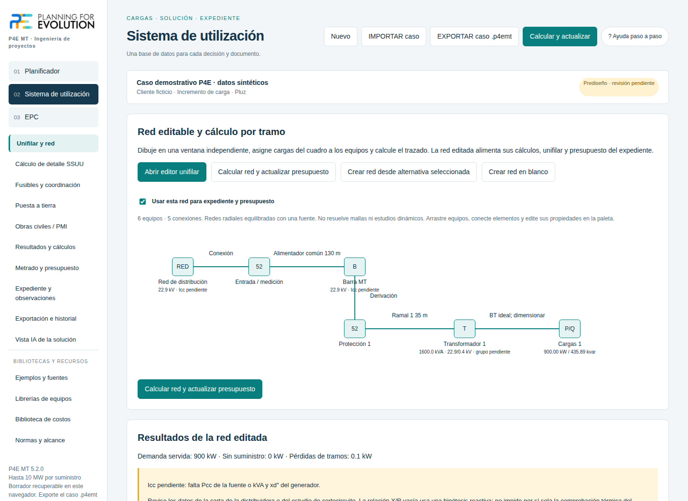

# Planning for Evolution · Ingeniería y herramientas digitales

**Primero la necesidad del sistema. Luego la tecnología. Finalmente, el mecanismo regulatorio.**

Desarrollamos estudios y herramientas para apoyar decisiones en sistemas eléctricos, almacenamiento de energía y proyectos de media tensión. Este portafolio presenta dos aplicaciones de P4E y su alcance actual.

| Producto | Qué ayuda a resolver | Estado |
|---|---|---|
| **[BESS Investment Lab](productos/bess-investment-lab.md)** | Conectar necesidad, potencia, energía, operación y evaluación económica de almacenamiento. | V2 en validación · [Vista previa](https://bess-investment-lab-v2-preview.harambulo.workers.dev/) |
| **[P4E MT](productos/p4e-mt.md)** | Organizar cargas, prediseño radial, red, metrados, presupuesto y expediente de media tensión. | Aplicación local 5.2.0 · demostración bajo coordinación |

## Explora las aplicaciones

### BESS Investment Lab

[Ver el recorrido de BESS: necesidad, diseño y evaluación económica](productos/bess-investment-lab.md#recorrido-visual).

### P4E MT

[Ver el recorrido de P4E MT: cargas, red y presupuesto](productos/p4e-mt.md#recorrido-visual).

Las seis capturas usan casos demostrativos con datos sintéticos.

## Cómo trabajamos

1. **Diagnóstico:** identificar la necesidad, las restricciones y los datos disponibles.
2. **Ingeniería:** contrastar alternativas, comprobar cálculos y documentar supuestos.
3. **Decisión:** explicar resultados, límites y siguientes estudios necesarios.

Las aplicaciones apoyan la revisión de ingeniería. Sus resultados preliminares requieren validar los datos y el alcance del proyecto. Los casos demostrativos no representan proyectos ni información de clientes.

## Alcance de este repositorio

Este repositorio contiene fichas técnicas y material demostrativo de los aplicativos. El código comercial y los estudios de clientes se gestionan en repositorios privados.

*Portafolio actualizado el 6 de octubre de 2026.*
