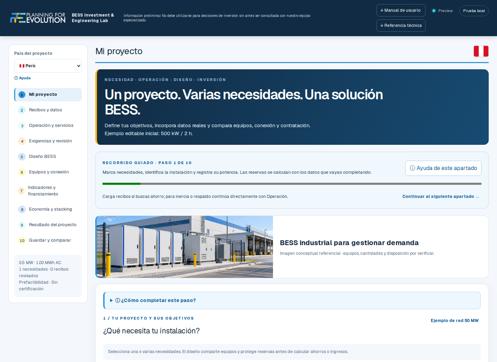
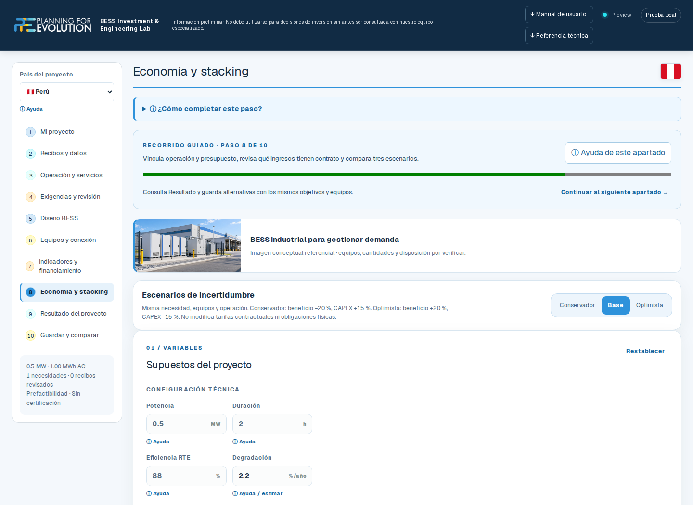

# BESS Investment Lab

**¿Qué necesita tu sistema y qué papel puede cumplir un BESS?**

El aplicativo organiza un recorrido desde la necesidad técnica hasta el predimensionamiento, la operación y la evaluación económica. Permite revisar hipótesis antes de avanzar hacia estudios y cotizaciones de mayor detalle.

| Etapa | Trabajo que facilita |
|---|---|
| Necesidad | Identificar respaldo, gestión de demanda, integración renovable o servicios de frecuencia. |
| Datos | Revisar recibos, perfiles y parámetros del proyecto; distinguir estimaciones de datos confirmados. |
| Diseño | Relacionar potencia, energía, estado de carga, degradación y límites de equipos. |
| Inversión | Comparar presupuestos, contratos y escenarios económicos según supuestos explícitos. |

## Demostración

[Abrir la vista previa de BESS Investment Lab V2](https://bess-investment-lab-v2-preview.harambulo.workers.dev/).

V2 está en validación. Su identificador técnico de prepublicación es **6.0.0-beta.1**. La vista previa evoluciona durante el desarrollo.

## Recorrido visual

Capturas de la aplicación con datos sintéticos para demostración. Los valores no representan un proyecto ni información de clientes.

### 1. Necesidad del sistema

### 2. Predimensionamiento

### 3. Evaluación económica

## Alcance

Herramienta de prefactibilidad y formación. No acredita desempeño dinámico, habilitación de servicios ni aprobación de un operador. Los ingresos y costos dependen de datos y condiciones documentadas para cada caso. Los proyectos se conservan en el navegador o mediante archivos exportados.

[Volver al portafolio](../README.md)
